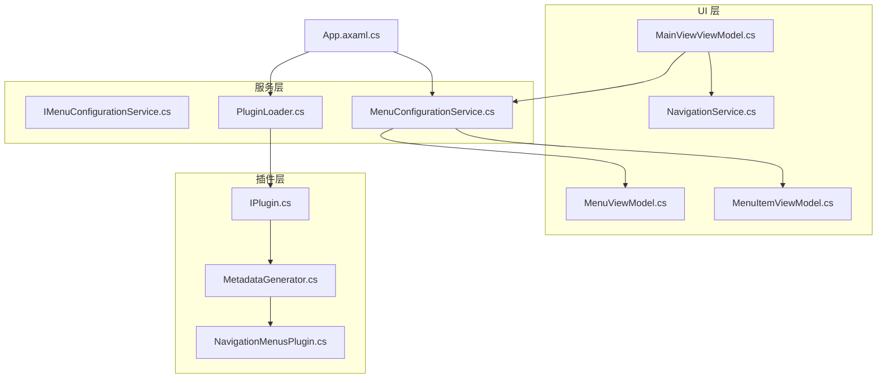
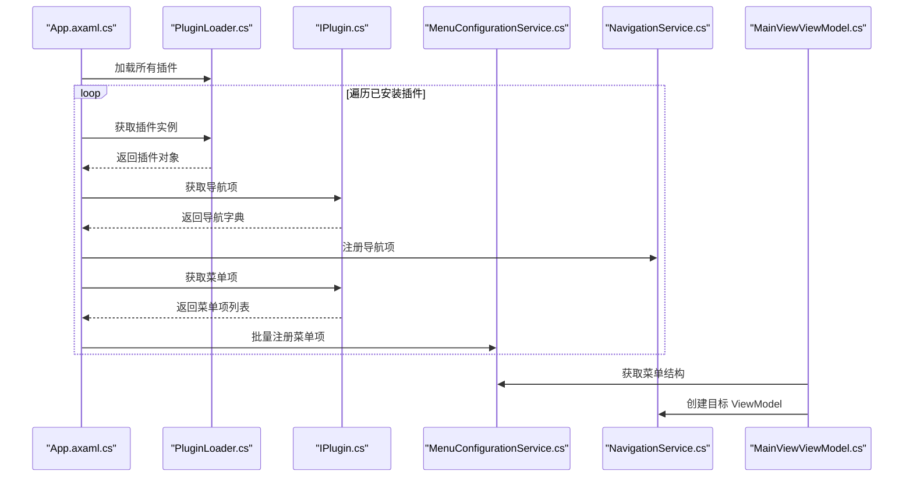
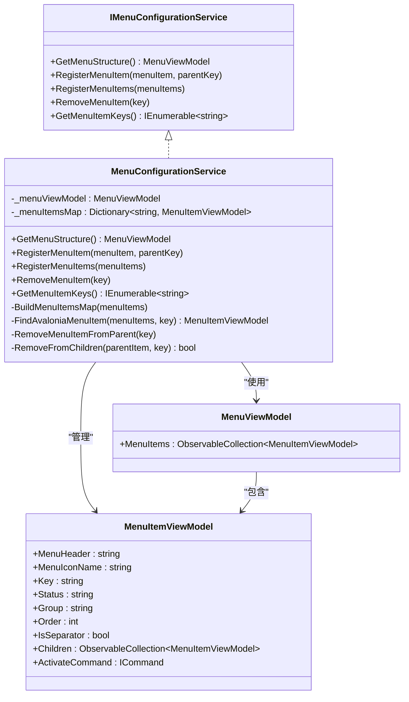
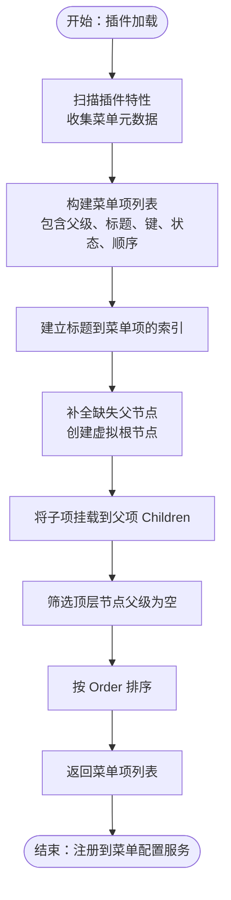
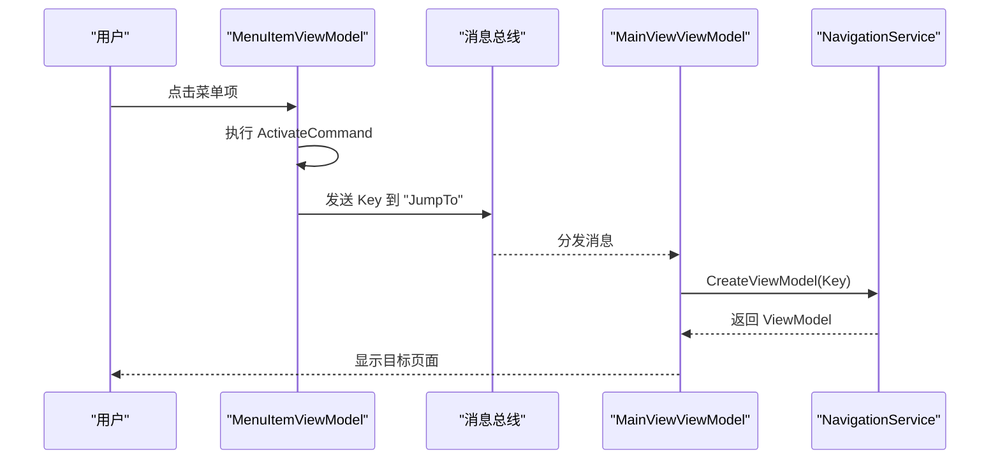
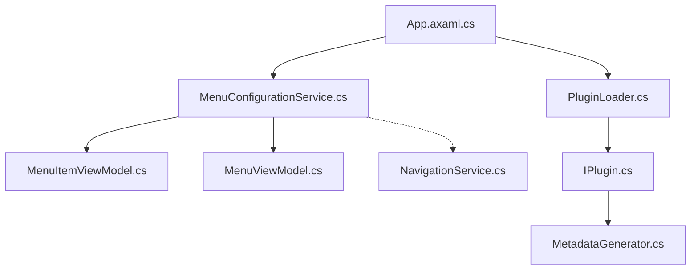

# 菜单配置服务

<cite>
**本文档引用的文件**
- [IMenuConfigurationService.cs](file://src/Avalonia.UI/Serivces/IMenuConfigurationService.cs)
- [MenuConfigurationService.cs](file://src/Avalonia.UI/Serivces/MenuConfigurationService.cs)
- [MenuItemViewModel.cs](file://src/Avalonia.Plugin.Shared/ViewModels/MenuItemViewModel.cs)
- [MenuViewModel.cs](file://src/Avalonia.UI/ViewModels/MenuViewModel.cs)
- [PluginLoader.cs](file://src/Avalonia.UI/Serivces/PluginLoader.cs)
- [IPlugin.cs](file://src/Avalonia.Plugin.Shared/IPlugin.cs)
- [NavigationService.cs](file://src/Avalonia.UI/Serivces/NavigationService.cs)
- [App.axaml.cs](file://src/launcher/Avalonia.Launcher.Desktop/App.axaml.cs)
- [MainViewViewModel.cs](file://src/Avalonia.UI/ViewModels/MainViewViewModel.cs)
- [MetadataGenerator.cs](file://src/Avalonia.Plugin.Generators/MetadataGenerator.cs)
- [NavigationMenusPlugin.cs](file://plugins/Avalonia.Plugin.NavigationMenus/NavigationMenusPlugin.cs)
</cite>

## 目录
1. [简介](#简介)
2. [项目结构](#项目结构)
3. [核心组件](#核心组件)
4. [架构总览](#架构总览)
5. [详细组件分析](#详细组件分析)
6. [依赖分析](#依赖分析)
7. [性能考量](#性能考量)
8. [故障排除指南](#故障排除指南)
9. [结论](#结论)
10. [附录](#附录)

## 简介
本文件围绕菜单配置服务（MenuConfigurationService）进行深入说明，涵盖动态菜单生成的实现原理、菜单项的注册与排序、自定义配置方式，以及与插件系统的集成机制。文档还解释了菜单配置服务与导航服务的协作关系，支持复杂菜单层次结构的方法，并提供性能优化、用户体验与最佳实践建议。

## 项目结构
菜单配置服务位于应用 UI 层的服务目录中，配合共享的插件模型与生成器，实现从插件收集菜单信息并生成最终菜单结构的能力。关键文件分布如下：
- 服务接口与实现：IMenuConfigurationService.cs、MenuConfigurationService.cs
- 菜单项与菜单根模型：MenuItemViewModel.cs、MenuViewModel.cs
- 插件系统与加载器：IPlugin.cs、PluginLoader.cs
- 导航服务：NavigationService.cs
- 应用启动与插件加载：App.axaml.cs
- 主界面视图模型：MainViewViewModel.cs
- 菜单元数据生成器：MetadataGenerator.cs
- 示例插件：NavigationMenusPlugin.cs

图表来源
- [IMenuConfigurationService.cs:1-40](file://src/Avalonia.UI/Serivces/IMenuConfigurationService.cs#L1-L40)
- [MenuConfigurationService.cs:1-194](file://src/Avalonia.UI/Serivces/MenuConfigurationService.cs#L1-L194)
- [MenuItemViewModel.cs:1-40](file://src/Avalonia.Plugin.Shared/ViewModels/MenuItemViewModel.cs#L1-L40)
- [MenuViewModel.cs:1-19](file://src/Avalonia.UI/ViewModels/MenuViewModel.cs#L1-L19)
- [PluginLoader.cs:1-460](file://src/Avalonia.UI/Serivces/PluginLoader.cs#L1-L460)
- [IPlugin.cs:1-81](file://src/Avalonia.Plugin.Shared/IPlugin.cs#L1-L81)
- [NavigationService.cs:1-62](file://src/Avalonia.UI/Serivces/NavigationService.cs#L1-L62)
- [App.axaml.cs:54-80](file://src/launcher/Avalonia.Launcher.Desktop/App.axaml.cs#L54-L80)
- [MetadataGenerator.cs:1-200](file://src/Avalonia.Plugin.Generators/MetadataGenerator.cs#L1-L200)
- [NavigationMenusPlugin.cs:1-20](file://plugins/Avalonia.Plugin.NavigationMenus/NavigationMenusPlugin.cs#L1-L20)

章节来源
- [IMenuConfigurationService.cs:1-40](file://src/Avalonia.UI/Serivces/IMenuConfigurationService.cs#L1-L40)
- [MenuConfigurationService.cs:1-194](file://src/Avalonia.UI/Serivces/MenuConfigurationService.cs#L1-L194)
- [MenuItemViewModel.cs:1-40](file://src/Avalonia.Plugin.Shared/ViewModels/MenuItemViewModel.cs#L1-L40)
- [MenuViewModel.cs:1-19](file://src/Avalonia.UI/ViewModels/MenuViewModel.cs#L1-L19)
- [PluginLoader.cs:1-460](file://src/Avalonia.UI/Serivces/PluginLoader.cs#L1-L460)
- [IPlugin.cs:1-81](file://src/Avalonia.Plugin.Shared/IPlugin.cs#L1-L81)
- [NavigationService.cs:1-62](file://src/Avalonia.UI/Serivces/NavigationService.cs#L1-L62)
- [App.axaml.cs:54-80](file://src/launcher/Avalonia.Launcher.Desktop/App.axaml.cs#L54-L80)
- [MetadataGenerator.cs:1-200](file://src/Avalonia.Plugin.Generators/MetadataGenerator.cs#L1-L200)
- [NavigationMenusPlugin.cs:1-20](file://plugins/Avalonia.Plugin.NavigationMenus/NavigationMenusPlugin.cs#L1-L20)

## 核心组件
- 菜单配置服务接口（IMenuConfigurationService）
  - 提供获取完整菜单结构、注册/批量注册/移除菜单项、查询菜单项键等能力。
- 菜单配置服务实现（MenuConfigurationService）
  - 维护根菜单与菜单项映射表，支持树形结构构建与查找，提供注册、移除与键查询功能。
- 菜单项模型（MenuItemViewModel）
  - 包含标题、图标名、键、状态、分组、顺序、是否分隔符、子项集合与激活命令等属性。
- 菜单根模型（MenuViewModel）
  - 默认包含“Introduction”入口项，提供可观察的菜单项集合。
- 插件接口（IPlugin）
  - 定义插件提供菜单项、导航项与视图映射的标准方法。
- 插件加载器（PluginLoader）
  - 负责扫描、加载插件程序集，解析元数据与插件实例，维护插件生命周期。
- 导航服务（NavigationService）
  - 维护导航键到 ViewModel 工厂的映射，负责创建目标页面的 ViewModel。
- 应用启动流程（App.axaml.cs）
  - 启动时加载插件，调用插件的导航与菜单接口，并将菜单项注册至菜单配置服务。
- 元数据生成器（MetadataGenerator）
  - 编译期扫描插件中的菜单元数据，生成树形结构与排序逻辑，输出插件实现。
- 示例插件（NavigationMenusPlugin）
  - 使用元数据特性声明菜单项，由生成器注入到插件实现中。

章节来源
- [IMenuConfigurationService.cs:1-40](file://src/Avalonia.UI/Serivces/IMenuConfigurationService.cs#L1-L40)
- [MenuConfigurationService.cs:1-194](file://src/Avalonia.UI/Serivces/MenuConfigurationService.cs#L1-L194)
- [MenuItemViewModel.cs:1-40](file://src/Avalonia.Plugin.Shared/ViewModels/MenuItemViewModel.cs#L1-L40)
- [MenuViewModel.cs:1-19](file://src/Avalonia.UI/ViewModels/MenuViewModel.cs#L1-L19)
- [IPlugin.cs:1-81](file://src/Avalonia.Plugin.Shared/IPlugin.cs#L1-L81)
- [PluginLoader.cs:1-460](file://src/Avalonia.UI/Serivces/PluginLoader.cs#L1-L460)
- [NavigationService.cs:1-62](file://src/Avalonia.UI/Serivces/NavigationService.cs#L1-L62)
- [App.axaml.cs:54-80](file://src/launcher/Avalonia.Launcher.Desktop/App.axaml.cs#L54-L80)
- [MetadataGenerator.cs:1-200](file://src/Avalonia.Plugin.Generators/MetadataGenerator.cs#L1-L200)
- [NavigationMenusPlugin.cs:1-20](file://plugins/Avalonia.Plugin.NavigationMenus/NavigationMenusPlugin.cs#L1-L20)

## 架构总览
菜单配置服务通过插件系统动态收集菜单项，结合元数据生成器在编译期完成树形结构与排序，运行时由应用启动阶段统一注册到服务中，最终由主界面视图模型消费并呈现。

图表来源
- [App.axaml.cs:54-80](file://src/launcher/Avalonia.Launcher.Desktop/App.axaml.cs#L54-L80)
- [PluginLoader.cs:1-460](file://src/Avalonia.UI/Serivces/PluginLoader.cs#L1-L460)
- [IPlugin.cs:1-81](file://src/Avalonia.Plugin.Shared/IPlugin.cs#L1-L81)
- [MenuConfigurationService.cs:1-194](file://src/Avalonia.UI/Serivces/MenuConfigurationService.cs#L1-L194)
- [NavigationService.cs:1-62](file://src/Avalonia.UI/Serivces/NavigationService.cs#L1-L62)
- [MainViewViewModel.cs:35-52](file://src/Avalonia.UI/ViewModels/MainViewViewModel.cs#L35-L52)

## 详细组件分析

### 菜单配置服务接口与实现
- 接口职责
  - 获取完整菜单结构：返回包含根菜单项的菜单视图模型。
  - 注册菜单项：支持无父级（根级）与带父级（子级）两种注册方式。
  - 批量注册菜单项：接收父级键与菜单项的配对列表，统一注册。
  - 移除菜单项：根据键定位并从父级集合中移除，同时清理映射。
  - 查询菜单项键：返回当前已注册的所有菜单项键集合。
- 实现要点
  - 内部维护根菜单与键到菜单项的映射表，便于快速定位父级与子级。
  - 构建映射时深拷贝关键字段，避免外部修改影响内部结构。
  - 查找父级采用递归遍历，确保树形结构正确挂载。
  - 移除操作先从根级查找，再逐层子级查找，保证完整性。

图表来源
- [IMenuConfigurationService.cs:1-40](file://src/Avalonia.UI/Serivces/IMenuConfigurationService.cs#L1-L40)
- [MenuConfigurationService.cs:1-194](file://src/Avalonia.UI/Serivces/MenuConfigurationService.cs#L1-L194)
- [MenuViewModel.cs:1-19](file://src/Avalonia.UI/ViewModels/MenuViewModel.cs#L1-L19)
- [MenuItemViewModel.cs:1-40](file://src/Avalonia.Plugin.Shared/ViewModels/MenuItemViewModel.cs#L1-L40)

章节来源
- [IMenuConfigurationService.cs:1-40](file://src/Avalonia.UI/Serivces/IMenuConfigurationService.cs#L1-L40)
- [MenuConfigurationService.cs:1-194](file://src/Avalonia.UI/Serivces/MenuConfigurationService.cs#L1-L194)
- [MenuViewModel.cs:1-19](file://src/Avalonia.UI/ViewModels/MenuViewModel.cs#L1-L19)
- [MenuItemViewModel.cs:1-40](file://src/Avalonia.Plugin.Shared/ViewModels/MenuItemViewModel.cs#L1-L40)

### 动态菜单生成与插件集成
- 插件接口定义
  - IPlugin 暴露 GetMenuItems 方法，返回父级键与菜单项的配对列表，便于服务端进行树形组装。
- 元数据生成器
  - 在编译期扫描插件中带有特定特性的类，生成菜单树与排序逻辑，确保父子关系与顺序稳定。
  - 生成逻辑包含：收集菜单项、建立索引、补全缺失父节点、挂载子项、顶层过滤与排序。
- 应用启动阶段
  - 启动时加载插件，分别注册导航项与菜单项，菜单项通过菜单配置服务完成最终挂载。

图表来源
- [IPlugin.cs:1-81](file://src/Avalonia.Plugin.Shared/IPlugin.cs#L1-L81)
- [MetadataGenerator.cs:1-200](file://src/Avalonia.Plugin.Generators/MetadataGenerator.cs#L1-L200)
- [App.axaml.cs:54-80](file://src/launcher/Avalonia.Launcher.Desktop/App.axaml.cs#L54-L80)
- [MenuConfigurationService.cs:123-129](file://src/Avalonia.UI/Serivces/MenuConfigurationService.cs#L123-L129)

章节来源
- [IPlugin.cs:1-81](file://src/Avalonia.Plugin.Shared/IPlugin.cs#L1-L81)
- [MetadataGenerator.cs:1-200](file://src/Avalonia.Plugin.Generators/MetadataGenerator.cs#L1-L200)
- [App.axaml.cs:54-80](file://src/launcher/Avalonia.Launcher.Desktop/App.axaml.cs#L54-L80)
- [MenuConfigurationService.cs:123-129](file://src/Avalonia.UI/Serivces/MenuConfigurationService.cs#L123-L129)

### 菜单项模型与激活机制
- 菜单项模型包含：
  - 标题、图标名、键、状态、分组、顺序、是否分隔符、子项集合。
  - 激活命令在执行时通过消息总线发送键值，触发导航跳转。
- 导航服务与菜单配置服务协作：
  - 菜单项激活后，主界面视图模型监听消息并创建对应 ViewModel，实现页面切换。

图表来源
- [MenuItemViewModel.cs:1-40](file://src/Avalonia.Plugin.Shared/ViewModels/MenuItemViewModel.cs#L1-L40)
- [MainViewViewModel.cs:35-52](file://src/Avalonia.UI/ViewModels/MainViewViewModel.cs#L35-L52)
- [NavigationService.cs:1-62](file://src/Avalonia.UI/Serivces/NavigationService.cs#L1-L62)

章节来源
- [MenuItemViewModel.cs:1-40](file://src/Avalonia.Plugin.Shared/ViewModels/MenuItemViewModel.cs#L1-L40)
- [MainViewViewModel.cs:35-52](file://src/Avalonia.UI/ViewModels/MainViewViewModel.cs#L35-L52)
- [NavigationService.cs:1-62](file://src/Avalonia.UI/Serivces/NavigationService.cs#L1-L62)

### 复杂菜单层次结构支持
- 支持多级嵌套：通过递归查找与挂载，可在任意层级插入子项。
- 虚拟父节点：当父级标题不存在时，生成器会自动创建虚拟根节点，保证树形结构完整性。
- 顺序控制：通过 Order 字段控制同级排序，生成器在顶层节点处进行排序输出。

章节来源
- [MetadataGenerator.cs:90-126](file://src/Avalonia.Plugin.Generators/MetadataGenerator.cs#L90-L126)
- [MenuConfigurationService.cs:101-121](file://src/Avalonia.UI/Serivces/MenuConfigurationService.cs#L101-L121)

## 依赖分析
- 组件耦合
  - 菜单配置服务依赖菜单模型与插件接口；与导航服务解耦，仅通过键值通信。
  - 插件加载器负责插件生命周期与实例化，应用启动阶段集中调用。
- 外部依赖
  - 共享插件模型与生成器提供编译期元数据处理能力。
  - 消息总线用于菜单项激活与导航联动。

图表来源
- [MenuConfigurationService.cs:1-194](file://src/Avalonia.UI/Serivces/MenuConfigurationService.cs#L1-L194)
- [MenuItemViewModel.cs:1-40](file://src/Avalonia.Plugin.Shared/ViewModels/MenuItemViewModel.cs#L1-L40)
- [MenuViewModel.cs:1-19](file://src/Avalonia.UI/ViewModels/MenuViewModel.cs#L1-L19)
- [NavigationService.cs:1-62](file://src/Avalonia.UI/Serivces/NavigationService.cs#L1-L62)
- [App.axaml.cs:54-80](file://src/launcher/Avalonia.Launcher.Desktop/App.axaml.cs#L54-L80)
- [PluginLoader.cs:1-460](file://src/Avalonia.UI/Serivces/PluginLoader.cs#L1-L460)
- [IPlugin.cs:1-81](file://src/Avalonia.Plugin.Shared/IPlugin.cs#L1-L81)
- [MetadataGenerator.cs:1-200](file://src/Avalonia.Plugin.Generators/MetadataGenerator.cs#L1-L200)

章节来源
- [MenuConfigurationService.cs:1-194](file://src/Avalonia.UI/Serivces/MenuConfigurationService.cs#L1-L194)
- [NavigationService.cs:1-62](file://src/Avalonia.UI/Serivces/NavigationService.cs#L1-L62)
- [App.axaml.cs:54-80](file://src/launcher/Avalonia.Launcher.Desktop/App.axaml.cs#L54-L80)
- [PluginLoader.cs:1-460](file://src/Avalonia.UI/Serivces/PluginLoader.cs#L1-L460)
- [IPlugin.cs:1-81](file://src/Avalonia.Plugin.Shared/IPlugin.cs#L1-L81)
- [MetadataGenerator.cs:1-200](file://src/Avalonia.Plugin.Generators/MetadataGenerator.cs#L1-L200)

## 性能考量
- 树形构建与查找
  - 构建映射时进行深拷贝，避免外部修改影响内部结构，但需注意内存占用。
  - 查找父级采用递归遍历，建议控制菜单层级深度与节点数量，必要时引入缓存策略。
- 批量注册
  - 批量注册通过一次遍历完成，减少重复查找成本，推荐优先使用 RegisterMenuItems。
- 插件加载
  - 插件加载器使用独立的加载上下文，避免强依赖导致的内存泄漏；建议在应用启动阶段完成一次性加载。
- 导航与渲染
  - 菜单项激活通过消息总线触发导航，避免直接耦合视图层，降低渲染压力。

## 故障排除指南
- 菜单项未显示
  - 检查插件是否成功加载且返回菜单项列表。
  - 确认菜单项键不为空，且父级键存在或生成器已补全虚拟父节点。
- 子项无法挂载到父级
  - 父级键不匹配或父级标题不存在会导致挂载失败；检查元数据生成器的索引与挂载逻辑。
- 激活命令无效
  - 确保菜单项键非空且未标记为分隔符；检查消息总线订阅与导航键注册。
- 插件加载异常
  - 检查插件依赖状态与程序集路径；查看插件加载器的日志输出与错误信息。

章节来源
- [MenuConfigurationService.cs:66-99](file://src/Avalonia.UI/Serivces/MenuConfigurationService.cs#L66-L99)
- [MetadataGenerator.cs:90-126](file://src/Avalonia.Plugin.Generators/MetadataGenerator.cs#L90-L126)
- [PluginLoader.cs:53-156](file://src/Avalonia.UI/Serivces/PluginLoader.cs#L53-L156)
- [NavigationService.cs:48-55](file://src/Avalonia.UI/Serivces/NavigationService.cs#L48-L55)

## 结论
菜单配置服务通过清晰的接口设计与插件集成机制，实现了动态、可扩展的菜单生成能力。结合元数据生成器与应用启动阶段的集中注册，能够在编译期完成树形结构与排序，在运行时提供稳定的菜单体验。配合导航服务的消息驱动模式，菜单项激活与页面切换解耦明确，具备良好的可维护性与扩展性。

## 附录

### 菜单配置示例（步骤说明）
- 定义菜单项
  - 在插件中使用元数据特性声明菜单项，包含标题、键、父级标题、状态与顺序。
- 设置菜单属性
  - 通过模型属性设置图标名、分组、状态与顺序，影响 UI 渲染与排序。
- 处理菜单事件
  - 菜单项激活命令通过消息总线发送键值，主界面视图模型监听并创建目标 ViewModel。
- 与导航协作
  - 插件同时提供导航项，菜单项与导航键一一对应，实现点击即跳转。

章节来源
- [NavigationMenusPlugin.cs:1-20](file://plugins/Avalonia.Plugin.NavigationMenus/NavigationMenusPlugin.cs#L1-L20)
- [MetadataGenerator.cs:47-52](file://src/Avalonia.Plugin.Generators/MetadataGenerator.cs#L47-L52)
- [MenuItemViewModel.cs:1-40](file://src/Avalonia.Plugin.Shared/ViewModels/MenuItemViewModel.cs#L1-L40)
- [MainViewViewModel.cs:35-52](file://src/Avalonia.UI/ViewModels/MainViewViewModel.cs#L35-L52)
- [NavigationService.cs:19-33](file://src/Avalonia.UI/Serivces/NavigationService.cs#L19-L33)