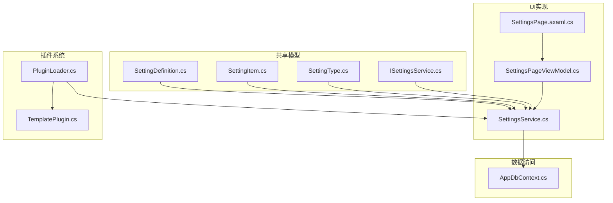
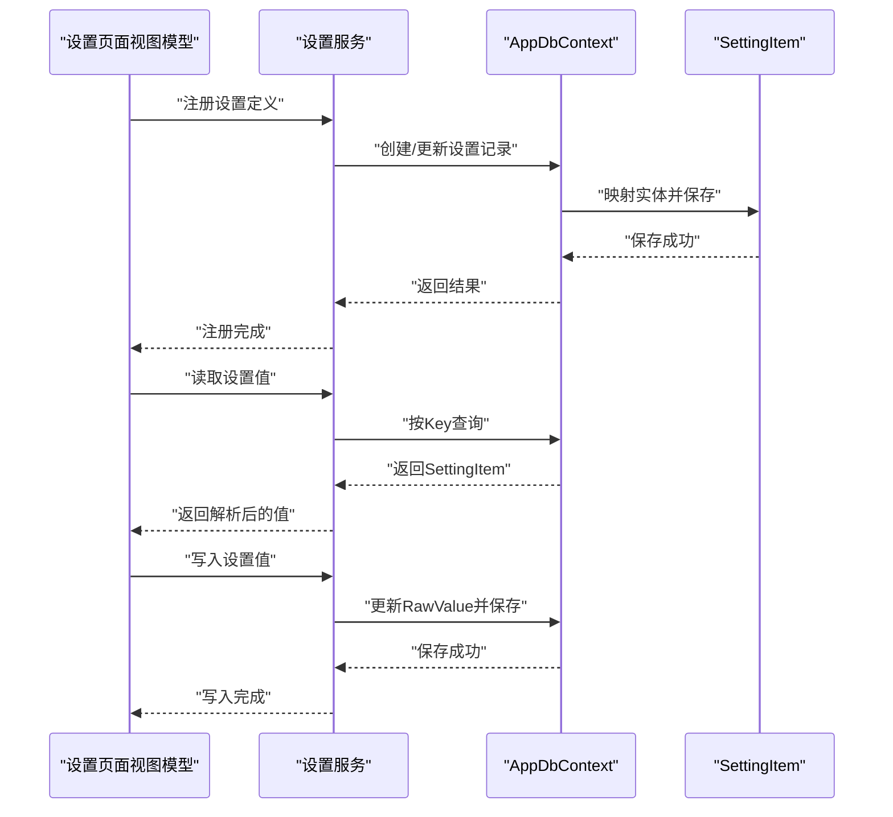
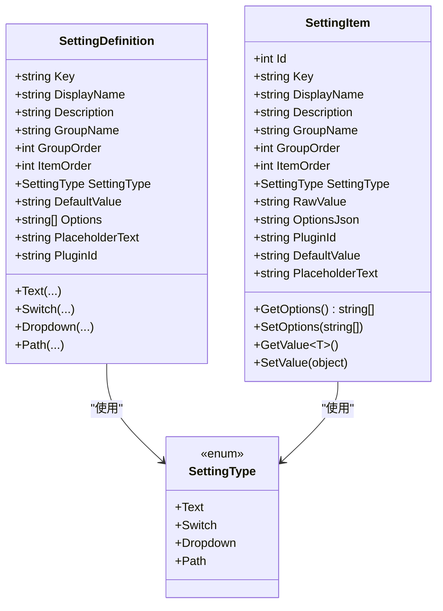
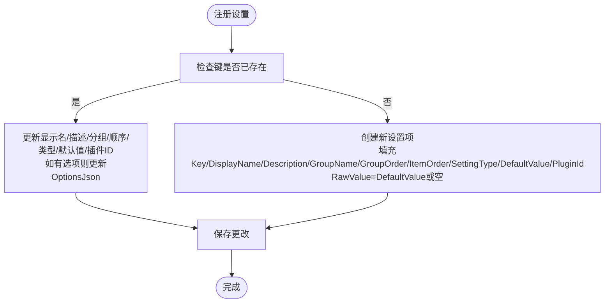
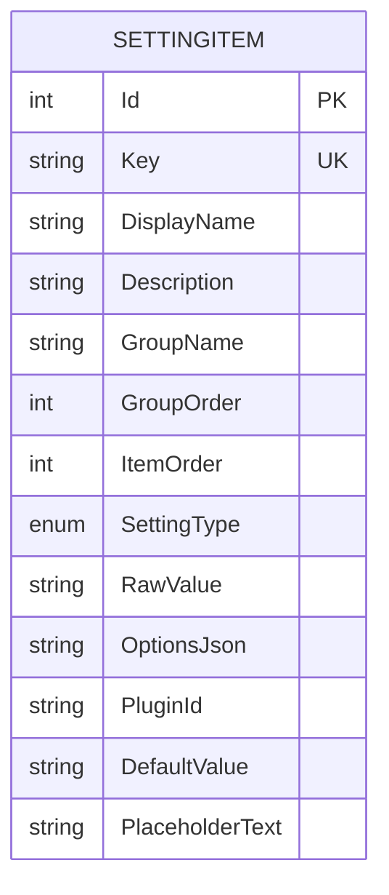
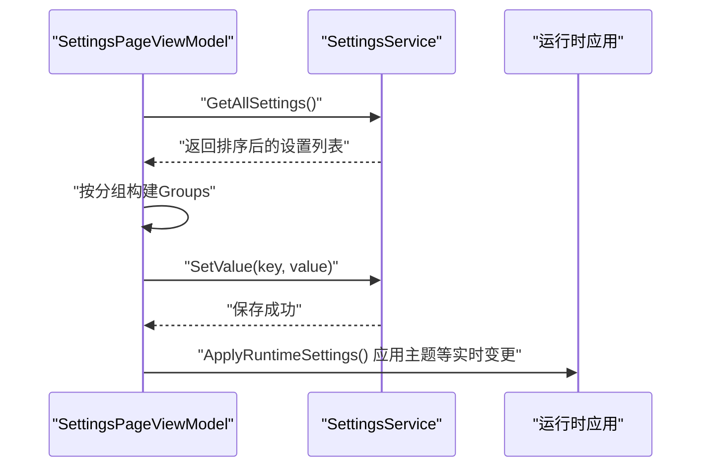
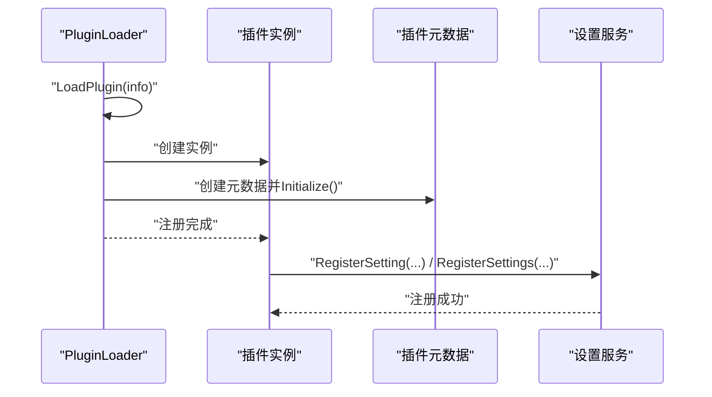
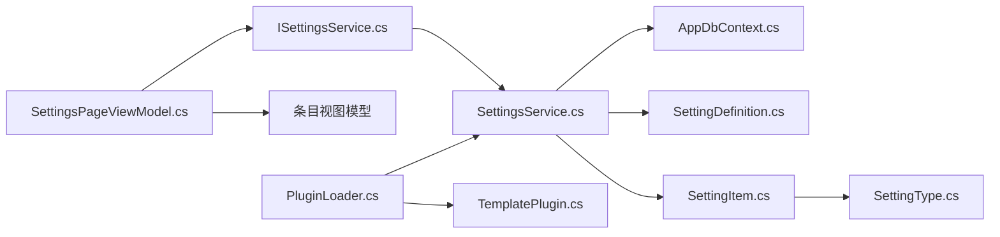

# 设置服务

<cite>
**本文引用的文件**
- [SettingDefinition.cs](file://src/Avalonia.Plugin.Shared/Models/SettingDefinition.cs)
- [SettingItem.cs](file://src/Avalonia.Plugin.Shared/Models/SettingItem.cs)
- [SettingType.cs](file://src/Avalonia.Plugin.Shared/Models/SettingType.cs)
- [ISettingsService.cs](file://src/Avalonia.Plugin.Shared/Services/ISettingsService.cs)
- [SettingsService.cs](file://src/Avalonia.UI/Services/SettingsService.cs)
- [AppDbContext.cs](file://src/Avalonia.UI/Data/AppDbContext.cs)
- [SettingsPageViewModel.cs](file://src/Avalonia.UI/ViewModels/SettingsPageViewModel.cs)
- [SettingsPage.axaml.cs](file://src/Avalonia.UI/Pages/SettingsPage.axaml.cs)
- [PluginLoader.cs](file://src/Avalonia.UI/Services/PluginLoader.cs)
- [TemplatePlugin.cs](file://plugins/Avalonia.Plugin.Template/TemplatePlugin.cs)
</cite>

## 目录
1. [简介](#简介)
2. [项目结构](#项目结构)
3. [核心组件](#核心组件)
4. [架构总览](#架构总览)
5. [详细组件分析](#详细组件分析)
6. [依赖关系分析](#依赖关系分析)
7. [性能考量](#性能考量)
8. [故障排查指南](#故障排查指南)
9. [结论](#结论)
10. [附录](#附录)

## 简介
本文件围绕设置服务（SettingsService）进行系统化说明，覆盖设置定义、数据模型、存储机制、动态更新、插件集成、持久化策略、性能与安全注意事项及最佳实践。设置服务通过统一接口管理应用与插件的配置项，提供注册、读取、写入、分组查询与默认初始化能力，并在UI层提供可交互的设置页面。

## 项目结构
设置服务相关代码分布在共享模型层与UI实现层：
- 共享模型：定义设置项的元数据与类型
- UI服务：实现设置服务接口，使用EF Core持久化到数据库
- 数据上下文：定义实体与约束
- 视图模型：承载设置页面的编辑、保存、运行时应用等逻辑
- 插件系统：通过插件元数据与加载器参与设置注册与生命周期管理

图表来源
- [SettingDefinition.cs:1-89](file://src/Avalonia.Plugin.Shared/Models/SettingDefinition.cs#L1-L89)
- [SettingItem.cs:1-61](file://src/Avalonia.Plugin.Shared/Models/SettingItem.cs#L1-L61)
- [SettingType.cs:1-10](file://src/Avalonia.Plugin.Shared/Models/SettingType.cs#L1-L10)
- [ISettingsService.cs:1-19](file://src/Avalonia.Plugin.Shared/Services/ISettingsService.cs#L1-L19)
- [SettingsService.cs:1-137](file://src/Avalonia.UI/Services/SettingsService.cs#L1-L137)
- [AppDbContext.cs:1-30](file://src/Avalonia.UI/Data/AppDbContext.cs#L1-L30)
- [SettingsPageViewModel.cs:1-329](file://src/Avalonia.UI/ViewModels/SettingsPageViewModel.cs#L1-L329)
- [SettingsPage.axaml.cs:1-11](file://src/Avalonia.UI/Pages/SettingsPage.axaml.cs#L1-L11)
- [PluginLoader.cs:1-460](file://src/Avalonia.UI/Services/PluginLoader.cs#L1-L460)
- [TemplatePlugin.cs:1-20](file://plugins/Avalonia.Plugin.Template/TemplatePlugin.cs#L1-L20)

章节来源
- [SettingDefinition.cs:1-89](file://src/Avalonia.Plugin.Shared/Models/SettingDefinition.cs#L1-L89)
- [SettingItem.cs:1-61](file://src/Avalonia.Plugin.Shared/Models/SettingItem.cs#L1-L61)
- [SettingType.cs:1-10](file://src/Avalonia.Plugin.Shared/Models/SettingType.cs#L1-L10)
- [ISettingsService.cs:1-19](file://src/Avalonia.Plugin.Shared/Services/ISettingsService.cs#L1-L19)
- [SettingsService.cs:1-137](file://src/Avalonia.UI/Services/SettingsService.cs#L1-L137)
- [AppDbContext.cs:1-30](file://src/Avalonia.UI/Data/AppDbContext.cs#L1-L30)
- [SettingsPageViewModel.cs:1-329](file://src/Avalonia.UI/ViewModels/SettingsPageViewModel.cs#L1-L329)
- [SettingsPage.axaml.cs:1-11](file://src/Avalonia.UI/Pages/SettingsPage.axaml.cs#L1-L11)
- [PluginLoader.cs:1-460](file://src/Avalonia.UI/Services/PluginLoader.cs#L1-L460)
- [TemplatePlugin.cs:1-20](file://plugins/Avalonia.Plugin.Template/TemplatePlugin.cs#L1-L20)

## 核心组件
- 设置定义（SettingDefinition）：用于声明设置项的元信息（键、显示名、描述、分组、顺序、类型、默认值、选项、占位符、插件ID），并提供多种静态工厂方法快速构建不同类型的设置定义。
- 设置项（SettingItem）：持久化实体，包含键、显示名、分组、顺序、类型、原始值、默认值、选项JSON、插件ID、占位符等；提供泛型GetValue<T>()与SetValue(object)以支持类型转换与序列化。
- 设置类型（SettingType）：枚举定义文本、开关、下拉、路径四种类型。
- 设置服务接口（ISettingsService）：定义注册、批量注册、读取、写入、查询分组、获取全部、移除、初始化默认值等能力。
- 设置服务实现（SettingsService）：基于EF Core的数据库实现，负责设置项的注册、更新、查询与持久化。
- 数据上下文（AppDbContext）：定义Settings表的实体映射与字段约束。
- 视图模型（SettingsPageViewModel）：承载设置页面的分组、条目视图模型、保存/重置/刷新逻辑、运行时设置应用（如主题切换）。
- 插件系统（PluginLoader）：负责插件的发现、加载、卸载、启用/禁用、依赖校验与注册表维护；插件可通过元数据参与设置注册与生命周期。

章节来源
- [SettingDefinition.cs:1-89](file://src/Avalonia.Plugin.Shared/Models/SettingDefinition.cs#L1-L89)
- [SettingItem.cs:1-61](file://src/Avalonia.Plugin.Shared/Models/SettingItem.cs#L1-L61)
- [SettingType.cs:1-10](file://src/Avalonia.Plugin.Shared/Models/SettingType.cs#L1-L10)
- [ISettingsService.cs:1-19](file://src/Avalonia.Plugin.Shared/Services/ISettingsService.cs#L1-L19)
- [SettingsService.cs:1-137](file://src/Avalonia.UI/Services/SettingsService.cs#L1-L137)
- [AppDbContext.cs:1-30](file://src/Avalonia.UI/Data/AppDbContext.cs#L1-L30)
- [SettingsPageViewModel.cs:1-329](file://src/Avalonia.UI/ViewModels/SettingsPageViewModel.cs#L1-L329)
- [PluginLoader.cs:1-460](file://src/Avalonia.UI/Services/PluginLoader.cs#L1-L460)

## 架构总览
设置服务采用“共享模型 + UI服务实现 + EF Core持久化”的分层架构。UI层通过视图模型驱动设置页面，调用设置服务完成读写；设置服务通过数据上下文访问数据库；插件系统在加载过程中可向设置服务注册自定义设置。

图表来源
- [SettingsService.cs:17-83](file://src/Avalonia.UI/Services/SettingsService.cs#L17-L83)
- [AppDbContext.cs:6-28](file://src/Avalonia.UI/Data/AppDbContext.cs#L6-L28)
- [SettingItem.cs:34-59](file://src/Avalonia.Plugin.Shared/Models/SettingItem.cs#L34-L59)

## 详细组件分析

### 设置定义与数据模型
- SettingDefinition
  - 关键字段：Key、DisplayName、Description、GroupName、GroupOrder、ItemOrder、SettingType、DefaultValue、Options、PlaceholderText、PluginId
  - 工厂方法：提供Text、Switch、Dropdown、Path四类便捷构造，便于快速声明设置项
- SettingItem
  - 持久化字段：Id、Key、DisplayName、Description、GroupName、GroupOrder、ItemOrder、SettingType、RawValue、OptionsJson、PluginId、DefaultValue、PlaceholderText
  - 类型转换：GetValue<T>()支持bool/int/double与字符串的自动解析；SetValue(object)将布尔值序列化为"true"/"false"
  - 选项处理：通过OptionsJson进行序列化/反序列化
- SettingType
  - 枚举：Text、Switch、Dropdown、Path

图表来源
- [SettingDefinition.cs:3-87](file://src/Avalonia.Plugin.Shared/Models/SettingDefinition.cs#L3-L87)
- [SettingItem.cs:5-60](file://src/Avalonia.Plugin.Shared/Models/SettingItem.cs#L5-L60)
- [SettingType.cs:3-9](file://src/Avalonia.Plugin.Shared/Models/SettingType.cs#L3-L9)

章节来源
- [SettingDefinition.cs:1-89](file://src/Avalonia.Plugin.Shared/Models/SettingDefinition.cs#L1-L89)
- [SettingItem.cs:1-61](file://src/Avalonia.Plugin.Shared/Models/SettingItem.cs#L1-L61)
- [SettingType.cs:1-10](file://src/Avalonia.Plugin.Shared/Models/SettingType.cs#L1-L10)

### 设置服务接口与实现
- 接口职责
  - 注册单个或多个设置定义
  - 读取指定键的设置值（泛型/字符串）
  - 写入设置值
  - 查询全部设置、按分组查询、获取分组列表
  - 获取单个设置、移除设置
  - 初始化默认设置
- 实现要点
  - 使用IDbContextFactory创建数据库上下文，确保线程安全与生命周期可控
  - 注册时若键已存在则更新元信息与默认值，否则新增并使用默认值填充RawValue
  - 读取时优先使用用户值，为空则回退到默认值
  - 写入时仅更新RawValue并保存

图表来源
- [SettingsService.cs:17-55](file://src/Avalonia.UI/Services/SettingsService.cs#L17-L55)

章节来源
- [ISettingsService.cs:1-19](file://src/Avalonia.Plugin.Shared/Services/ISettingsService.cs#L1-L19)
- [SettingsService.cs:1-137](file://src/Avalonia.UI/Services/SettingsService.cs#L1-L137)

### 数据持久化与实体约束
- 实体映射
  - 主键：Id
  - 唯一键：Key
  - 字段长度限制：Key/DisplayName/GroupName/RawValue/DefaultValue/OptionsJson/PluginId等
- 约束意义
  - 唯一键保证设置项键的唯一性
  - 长度限制避免异常输入导致的存储问题
  - 明确的索引与约束提升查询与一致性

图表来源
- [AppDbContext.cs:14-28](file://src/Avalonia.UI/Data/AppDbContext.cs#L14-L28)

章节来源
- [AppDbContext.cs:1-30](file://src/Avalonia.UI/Data/AppDbContext.cs#L1-L30)

### 设置页面与运行时应用
- 页面与视图模型
  - SettingsPageViewModel负责加载所有设置，按分组组织，为每种设置类型创建对应的条目视图模型
  - 支持刷新、保存、重置操作；保存时调用设置服务写入当前值
  - 运行时应用：根据App.Theme即时切换主题变体
- 条目视图模型
  - 文本、开关、下拉、路径四类条目视图模型分别绑定对应控件，支持脏状态标记与保存状态提示
  - 路径类型提供文件选择命令

图表来源
- [SettingsPageViewModel.cs:107-127](file://src/Avalonia.UI/ViewModels/SettingsPageViewModel.cs#L107-L127)
- [SettingsService.cs:76-83](file://src/Avalonia.UI/Services/SettingsService.cs#L76-L83)
- [SettingsPageViewModel.cs:81-99](file://src/Avalonia.UI/ViewModels/SettingsPageViewModel.cs#L81-L99)

章节来源
- [SettingsPageViewModel.cs:1-329](file://src/Avalonia.UI/ViewModels/SettingsPageViewModel.cs#L1-L329)
- [SettingsPage.axaml.cs:1-11](file://src/Avalonia.UI/Pages/SettingsPage.axaml.cs#L1-L11)

### 插件系统集成与自定义设置
- 插件加载流程
  - PluginLoader负责扫描、加载、卸载插件，维护注册表与状态事件
  - 插件通过IPlugin/IPluginMetadata实现，可提供元数据与行为
- 设置注册集成
  - 插件可在初始化阶段调用设置服务注册自定义设置项（通过PluginId标识归属）
  - 设置服务支持为每个设置项关联PluginId，便于后续按插件维度管理与清理

图表来源
- [PluginLoader.cs:94-146](file://src/Avalonia.UI/Services/PluginLoader.cs#L94-L146)
- [TemplatePlugin.cs:16-19](file://plugins/Avalonia.Plugin.Template/TemplatePlugin.cs#L16-L19)
- [SettingsService.cs:17-63](file://src/Avalonia.UI/Services/SettingsService.cs#L17-L63)

章节来源
- [PluginLoader.cs:1-460](file://src/Avalonia.UI/Services/PluginLoader.cs#L1-L460)
- [TemplatePlugin.cs:1-20](file://plugins/Avalonia.Plugin.Template/TemplatePlugin.cs#L1-L20)
- [SettingsService.cs:1-137](file://src/Avalonia.UI/Services/SettingsService.cs#L1-L137)

## 依赖关系分析
- 组件耦合
  - SettingsService依赖ISettingsService接口与AppDbContext，实现与数据访问解耦
  - SettingsPageViewModel依赖ISettingsService与各条目视图模型，承担UI交互与业务编排
  - SettingDefinition/SettingItem/SettingType位于共享层，被UI与服务共同使用
- 外部依赖
  - EF Core用于ORM与数据库访问
  - CommunityToolkit.Mvvm提供MVVM基础与命令绑定
  - Avalonia平台提供存储与UI能力

图表来源
- [SettingsPageViewModel.cs:1-329](file://src/Avalonia.UI/ViewModels/SettingsPageViewModel.cs#L1-L329)
- [ISettingsService.cs:1-19](file://src/Avalonia.Plugin.Shared/Services/ISettingsService.cs#L1-L19)
- [SettingsService.cs:1-137](file://src/Avalonia.UI/Services/SettingsService.cs#L1-L137)
- [AppDbContext.cs:1-30](file://src/Avalonia.UI/Data/AppDbContext.cs#L1-L30)
- [SettingDefinition.cs:1-89](file://src/Avalonia.Plugin.Shared/Models/SettingDefinition.cs#L1-L89)
- [SettingItem.cs:1-61](file://src/Avalonia.Plugin.Shared/Models/SettingItem.cs#L1-L61)
- [SettingType.cs:1-10](file://src/Avalonia.Plugin.Shared/Models/SettingType.cs#L1-L10)
- [PluginLoader.cs:1-460](file://src/Avalonia.UI/Services/PluginLoader.cs#L1-L460)
- [TemplatePlugin.cs:1-20](file://plugins/Avalonia.Plugin.Template/TemplatePlugin.cs#L1-L20)

章节来源
- [SettingsPageViewModel.cs:1-329](file://src/Avalonia.UI/ViewModels/SettingsPageViewModel.cs#L1-L329)
- [SettingsService.cs:1-137](file://src/Avalonia.UI/Services/SettingsService.cs#L1-L137)
- [AppDbContext.cs:1-30](file://src/Avalonia.UI/Data/AppDbContext.cs#L1-L30)
- [PluginLoader.cs:1-460](file://src/Avalonia.UI/Services/PluginLoader.cs#L1-L460)

## 性能考量
- 数据库访问
  - 每次操作均创建独立上下文，避免跨线程共享上下文引发并发问题；对高频读取场景可考虑缓存常用设置值
- 查询排序
  - 按GroupOrder/ItemOrder排序，建议在数据库层面建立复合索引以优化分组与排序性能
- 序列化开销
  - OptionsJson的序列化/反序列化成本较低，但应避免频繁大对象更新；必要时采用增量更新策略
- UI交互
  - 保存时仅提交脏变更，减少不必要的数据库写入
- 插件加载
  - 插件加载涉及反射与程序集加载，建议在应用启动阶段完成预加载，避免运行时抖动

## 故障排查指南
- 设置未生效
  - 检查是否调用了SetValue并确认保存成功；确认键名一致且大小写正确
- 默认值不生效
  - 确认DefaultValue已在注册时设置；读取时若RawValue为空会回退到DefaultValue
- 分组/排序异常
  - 确认GroupOrder/ItemOrder设置合理；数据库中已按该顺序排序
- 插件设置缺失
  - 确认插件已加载且状态为Loaded；检查PluginId是否匹配；确认插件在初始化时调用了设置服务注册
- 数据库错误
  - 检查Key唯一性约束；确认字段长度未超过限制；查看EF Core日志定位具体SQL错误

章节来源
- [SettingsService.cs:65-83](file://src/Avalonia.UI/Services/SettingsService.cs#L65-L83)
- [AppDbContext.cs:14-28](file://src/Avalonia.UI/Data/AppDbContext.cs#L14-L28)
- [PluginLoader.cs:353-372](file://src/Avalonia.UI/Services/PluginLoader.cs#L353-L372)

## 结论
设置服务通过清晰的接口与数据模型，结合EF Core持久化与MVVM页面，提供了完整的配置管理能力。其支持多类型设置、分组与排序、默认值回退、运行时应用变更，并通过插件系统扩展至第三方扩展。遵循本文的最佳实践与性能建议，可在保证一致性的同时获得良好的用户体验与可维护性。

## 附录

### 设置管理示例（步骤说明）
- 定义设置项
  - 使用SettingDefinition的静态工厂方法创建文本、开关、下拉、路径等类型设置
  - 指定Key、显示名、分组、顺序、默认值、选项（下拉）、占位符（文本/路径）等
- 注册设置
  - 在应用启动或插件初始化时调用RegisterSetting/RegisterSettings
  - 若键已存在，将更新元信息与默认值
- 读取设置值
  - 使用GetValue<T>(key)或GetValue(key)读取；为空时回退到默认值
- 写入设置值
  - 使用SetValue(key, value)写入；仅更新RawValue并保存
- 监听设置变化
  - UI层通过条目视图模型的脏状态与保存命令实现变更监听与持久化
- 运行时应用
  - 在保存后调用运行时应用逻辑（如切换主题）

章节来源
- [SettingDefinition.cs:19-87](file://src/Avalonia.Plugin.Shared/Models/SettingDefinition.cs#L19-L87)
- [SettingsService.cs:17-83](file://src/Avalonia.UI/Services/SettingsService.cs#L17-L83)
- [SettingsPageViewModel.cs:37-99](file://src/Avalonia.UI/ViewModels/SettingsPageViewModel.cs#L37-L99)