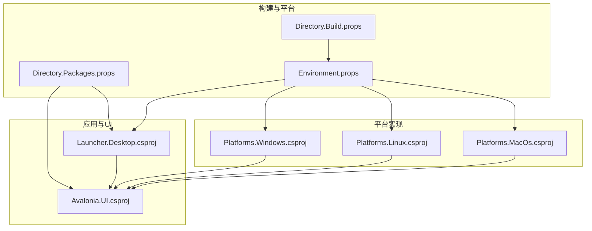
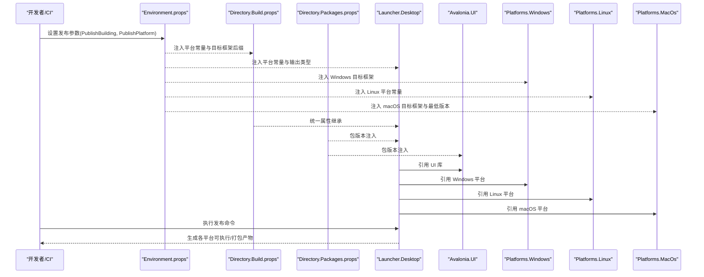
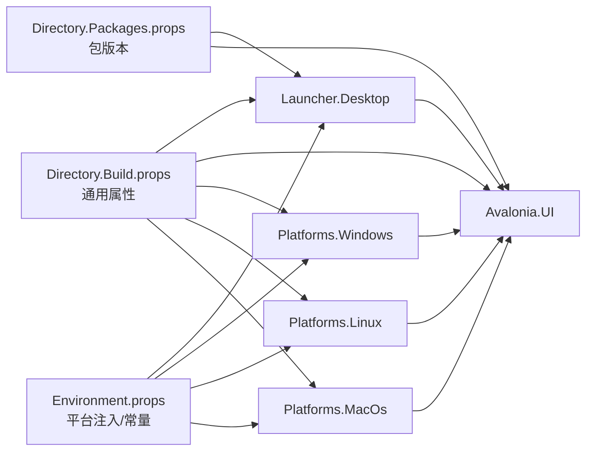

# 部署和发布

<cite>
**本文引用的文件**
- [src\Directory.Build.props](file://src/Directory.Build.props)
- [src\Directory.Packages.props](file://src/Directory.Packages.props)
- [src\Environment.props](file://src/Environment.props)
- [src\launcher\Avalonia.Launcher.Desktop\Avalonia.Launcher.Desktop.csproj](file://src/launcher/Avalonia.Launcher.Desktop/Avalonia.Launcher.Desktop.csproj)
- [src\launcher\Avalonia.Launcher.Desktop\app.manifest](file://src/launcher/Avalonia.Launcher.Desktop/app.manifest)
- [src\launcher\Avalonia.Launcher.Desktop\Properties\PublishProfiles\FolderProfile.pubxml](file://src/launcher/Avalonia.Launcher.Desktop/Properties/PublishProfiles/FolderProfile.pubxml)
- [src\Avalonia.UI\Avalonia.UI.csproj](file://src/Avalonia.UI/Avalonia.UI.csproj)
- [src\platforms\Avalonia.Platforms.Windows\Avalonia.Platforms.Windows.csproj](file://src/platforms/Avalonia.Platforms.Windows/Avalonia.Platforms.Windows.csproj)
- [src\platforms\Avalonia.Platforms.Linux\Avalonia.Platforms.Linux.csproj](file://src/platforms/Avalonia.Platforms.Linux/Avalonia.Platforms.Linux.csproj)
- [src\platforms\Avalonia.Platforms.MacOs\Avalonia.Platforms.MacOs.csproj](file://src/platforms/Avalonia.Platforms.MacOs/Avalonia.Platforms.MacOs.csproj)
</cite>

## 目录
1. [简介](#简介)
2. [项目结构](#项目结构)
3. [核心组件](#核心组件)
4. [架构总览](#架构总览)
5. [详细组件分析](#详细组件分析)
6. [依赖关系分析](#依赖关系分析)
7. [性能考量](#性能考量)
8. [故障排查指南](#故障排查指南)
9. [结论](#结论)
10. [附录](#附录)

## 简介
本指南面向 AvaloniaTemplate 的部署与发布，聚焦以下目标：
- 构建配置与优化：MSBuild 属性、包版本管理、平台条件编译。
- 多平台打包：Windows、Linux、macOS 的差异化配置与要求。
- 发布最佳实践：版本管理、签名与验证、分发策略。
- 应用程序清单与权限：Windows 可执行清单与运行时权限。
- 持续集成与自动化：基于环境变量与发布配置的跨平台流水线建议。
- 性能与安全：发布体积优化、运行时性能与安全加固要点。

## 项目结构
本仓库采用多项目结构，核心由桌面启动器、UI库、平台适配层与插件组成。构建系统通过目录级 props 文件集中管理公共属性与包版本，平台差异通过环境与发布参数动态注入。

图表来源
- [src\Directory.Build.props:1-11](file://src/Directory.Build.props#L1-L11)
- [src\Directory.Packages.props:1-10](file://src/Directory.Packages.props#L1-L10)
- [src\Environment.props:1-58](file://src/Environment.props#L1-L58)
- [src\launcher\Avalonia.Launcher.Desktop\Avalonia.Launcher.Desktop.csproj:1-33](file://src/launcher/Avalonia.Launcher.Desktop/Avalonia.Launcher.Desktop.csproj#L1-L33)
- [src\Avalonia.UI\Avalonia.UI.csproj:1-29](file://src/Avalonia.UI/Avalonia.UI.csproj#L1-L29)
- [src\platforms\Avalonia.Platforms.Windows\Avalonia.Platforms.Windows.csproj:1-26](file://src/platforms/Avalonia.Platforms.Windows/Avalonia.Platforms.Windows.csproj#L1-L26)
- [src\platforms\Avalonia.Platforms.Linux\Avalonia.Platforms.Linux.csproj:1-20](file://src/platforms/Avalonia.Platforms.Linux/Avalonia.Platforms.Linux.csproj#L1-L20)
- [src\platforms\Avalonia.Platforms.MacOs\Avalonia.Platforms.MacOs.csproj:1-15](file://src/platforms/Avalonia.Platforms.MacOs/Avalonia.Platforms.MacOs.csproj#L1-L15)

章节来源
- [src\Directory.Build.props:1-11](file://src/Directory.Build.props#L1-L11)
- [src\Directory.Packages.props:1-10](file://src/Directory.Packages.props#L1-L10)
- [src\Environment.props:1-58](file://src/Environment.props#L1-L58)

## 核心组件
- 目录级构建属性（Directory.Build.props）：统一目标框架、可空性支持、Windows 定向、重复发布输出检查等。
- 目录级包版本（Directory.Packages.props）：集中声明 Avalonia、依赖注入、Ursa、EF Core 等版本。
- 环境与平台属性（Environment.props）：按发布或开发环境自动选择平台、注入平台常量、定义目标框架后缀与 OS 版本。
- 启动器项目（Launcher.Desktop）：WinExe 输出类型、资源与依赖引用、对 UI 库与共享插件的引用。
- 平台项目：Windows/Linux/macOS 分别针对平台特性进行依赖与实现。

章节来源
- [src\Directory.Build.props:1-11](file://src/Directory.Build.props#L1-L11)
- [src\Directory.Packages.props:1-10](file://src/Directory.Packages.props#L1-L10)
- [src\Environment.props:1-58](file://src/Environment.props#L1-L58)
- [src\launcher\Avalonia.Launcher.Desktop\Avalonia.Launcher.Desktop.csproj:1-33](file://src/launcher/Avalonia.Launcher.Desktop/Avalonia.Launcher.Desktop.csproj#L1-L33)
- [src\Avalonia.UI\Avalonia.UI.csproj:1-29](file://src/Avalonia.UI/Avalonia.UI.csproj#L1-L29)
- [src\platforms\Avalonia.Platforms.Windows\Avalonia.Platforms.Windows.csproj:1-26](file://src/platforms/Avalonia.Platforms.Windows/Avalonia.Platforms.Windows.csproj#L1-L26)
- [src\platforms\Avalonia.Platforms.Linux\Avalonia.Platforms.Linux.csproj:1-20](file://src/platforms/Avalonia.Platforms.Linux/Avalonia.Platforms.Linux.csproj#L1-L20)
- [src\platforms\Avalonia.Platforms.MacOs\Avalonia.Platforms.MacOs.csproj:1-15](file://src/platforms/Avalonia.Platforms.MacOs/Avalonia.Platforms.MacOs.csproj#L1-L15)

## 架构总览
下图展示从构建到多平台发布的整体流程，以及关键配置如何影响最终产物。

图表来源
- [src\Environment.props:10-58](file://src/Environment.props#L10-L58)
- [src\Directory.Build.props:1-11](file://src/Directory.Build.props#L1-L11)
- [src\Directory.Packages.props:1-10](file://src/Directory.Packages.props#L1-L10)
- [src\launcher\Avalonia.Launcher.Desktop\Avalonia.Launcher.Desktop.csproj:1-33](file://src/launcher/Avalonia.Launcher.Desktop/Avalonia.Launcher.Desktop.csproj#L1-L33)
- [src\Avalonia.UI\Avalonia.UI.csproj:1-29](file://src/Avalonia.UI/Avalonia.UI.csproj#L1-L29)
- [src\platforms\Avalonia.Platforms.Windows\Avalonia.Platforms.Windows.csproj:1-26](file://src/platforms/Avalonia.Platforms.Windows/Avalonia.Platforms.Windows.csproj#L1-L26)
- [src\platforms\Avalonia.Platforms.Linux\Avalonia.Platforms.Linux.csproj:1-20](file://src/platforms/Avalonia.Platforms.Linux/Avalonia.Platforms.Linux.csproj#L1-L20)
- [src\platforms\Avalonia.Platforms.MacOs\Avalonia.Platforms.MacOs.csproj:1-15](file://src/platforms/Avalonia.Platforms.MacOs/Avalonia.Platforms.MacOs.csproj#L1-L15)

## 详细组件分析

### 构建与版本管理配置
- 目标框架与平台定向
  - 统一目标框架与可空性支持在目录级属性中集中设置，确保所有子项目一致。
  - Windows 定向开启以启用 Win32 相关能力；重复发布输出检查关闭以避免误报。
- 包版本集中管理
  - 使用目录级包版本文件统一管理 Avalonia、依赖注入、Ursa、EF Core 等版本，便于升级与一致性控制。
- 平台条件与常量
  - 通过环境属性在发布或开发阶段自动选择平台，并注入平台常量与目标框架后缀，保证编译期裁剪与运行时行为一致。

章节来源
- [src\Directory.Build.props:1-11](file://src/Directory.Build.props#L1-L11)
- [src\Directory.Packages.props:1-10](file://src/Directory.Packages.props#L1-L10)
- [src\Environment.props:10-58](file://src/Environment.props#L10-L58)

### 启动器与 UI 组件
- 启动器项目
  - WinExe 输出类型用于 Windows 可执行；资源与编译项按需包含/排除；引用 UI 库与共享插件。
  - 通过包版本属性引用 Avalonia 桌面与字体包，以及诊断支持与依赖注入。
- UI 库
  - 作为库项目被启动器引用；包含资源、包引用与对共享插件的引用；使用统一的包版本属性。

章节来源
- [src\launcher\Avalonia.Launcher.Desktop\Avalonia.Launcher.Desktop.csproj:1-33](file://src/launcher/Avalonia.Launcher.Desktop/Avalonia.Launcher.Desktop.csproj#L1-L33)
- [src\Avalonia.UI\Avalonia.UI.csproj:1-29](file://src/Avalonia.UI/Avalonia.UI.csproj#L1-L29)

### 平台适配层
- Windows 平台
  - 显式目标框架后缀与平台抽象层引用；引入通知、系统事件、Win32 互操作与快捷方式工厂等包。
- Linux 平台
  - 目标框架与可空性设置；DBus 依赖用于系统交互。
- macOS 平台
  - 目标框架后缀与最低系统版本；平台抽象层引用。

章节来源
- [src\platforms\Avalonia.Platforms.Windows\Avalonia.Platforms.Windows.csproj:1-26](file://src/platforms/Avalonia.Platforms.Windows/Avalonia.Platforms.Windows.csproj#L1-L26)
- [src\platforms\Avalonia.Platforms.Linux\Avalonia.Platforms.Linux.csproj:1-20](file://src/platforms/Avalonia.Platforms.Linux/Avalonia.Platforms.Linux.csproj#L1-L20)
- [src\platforms\Avalonia.Platforms.MacOs\Avalonia.Platforms.MacOs.csproj:1-15](file://src/platforms/Avalonia.Platforms.MacOs/Avalonia.Platforms.MacOs.csproj#L1-L15)

### 发布配置与清单
- 发布配置
  - 提供文件夹发布配置文件，用于本地或 CI 的文件夹发布场景。
- Windows 应用清单
  - 启动器包含应用清单文件，用于 Windows 平台的可执行元数据与权限声明。

章节来源
- [src\launcher\Avalonia.Launcher.Desktop\Properties\PublishProfiles\FolderProfile.pubxml](file://src/launcher/Avalonia.Launcher.Desktop/Properties/PublishProfiles/FolderProfile.pubxml)
- [src\launcher\Avalonia.Launcher.Desktop\app.manifest](file://src/launcher/Avalonia.Launcher.Desktop/app.manifest)

## 依赖关系分析
下图展示项目间的依赖关系与平台注入点，帮助理解发布时的裁剪与组合逻辑。

图表来源
- [src\Environment.props:10-58](file://src/Environment.props#L10-L58)
- [src\Directory.Build.props:1-11](file://src/Directory.Build.props#L1-L11)
- [src\Directory.Packages.props:1-10](file://src/Directory.Packages.props#L1-L10)
- [src\launcher\Avalonia.Launcher.Desktop\Avalonia.Launcher.Desktop.csproj:1-33](file://src/launcher/Avalonia.Launcher.Desktop/Avalonia.Launcher.Desktop.csproj#L1-L33)
- [src\Avalonia.UI\Avalonia.UI.csproj:1-29](file://src/Avalonia.UI/Avalonia.UI.csproj#L1-L29)
- [src\platforms\Avalonia.Platforms.Windows\Avalonia.Platforms.Windows.csproj:1-26](file://src/platforms/Avalonia.Platforms.Windows/Avalonia.Platforms.Windows.csproj#L1-L26)
- [src\platforms\Avalonia.Platforms.Linux\Avalonia.Platforms.Linux.csproj:1-20](file://src/platforms/Avalonia.Platforms.Linux/Avalonia.Platforms.Linux.csproj#L1-L20)
- [src\platforms\Avalonia.Platforms.MacOs\Avalonia.Platforms.MacOs.csproj:1-15](file://src/platforms/Avalonia.Platforms.MacOs/Avalonia.Platforms.MacOs.csproj#L1-L15)

## 性能考量
- 发布体积优化
  - 在 Release 配置下启用原生代码内联与修剪，减少运行时体积。
  - 对非必要资源进行排除或延迟加载，降低冷启动时间。
- 运行时性能
  - 使用统一的目标框架与包版本，避免多版本依赖导致的 JIT 压力。
  - 平台层按需引用，避免不必要的系统服务调用。
- 安全加固
  - Windows 平台启用最小权限模型，仅声明必需的 UAC 权限。
  - macOS/Linux 平台遵循沙箱与最小权限原则，避免访问敏感路径。

## 故障排查指南
- 平台选择异常
  - 检查发布参数是否正确传递（发布模式与平台），确认环境属性中的平台条件分支生效。
- 目标框架不匹配
  - 确认目录级构建属性与平台项目的目标框架后缀一致，避免运行时加载失败。
- 包版本冲突
  - 统一通过目录级包版本文件管理，避免子项目直接硬编码版本。
- 清单与权限问题
  - Windows 平台检查应用清单中的权限声明与实际运行需求是否一致。

章节来源
- [src\Environment.props:10-58](file://src/Environment.props#L10-L58)
- [src\Directory.Build.props:1-11](file://src/Directory.Build.props#L1-L11)
- [src\Directory.Packages.props:1-10](file://src/Directory.Packages.props#L1-L10)
- [src\launcher\Avalonia.Launcher.Desktop\app.manifest](file://src/launcher/Avalonia.Launcher.Desktop/app.manifest)

## 结论
通过目录级构建与包版本管理、平台条件注入与清晰的项目依赖关系，AvaloniaTemplate 能够在 Windows、Linux、macOS 上稳定地完成构建与发布。结合清单与权限配置、版本与签名策略以及 CI 自动化，可形成一套可复用且可审计的部署流水线。

## 附录

### 多平台打包流程与要求
- Windows
  - 目标框架后缀与平台常量已注入；WinExe 输出类型在 Release 下生效。
  - 可通过文件夹发布配置进行本地打包，或进一步生成安装包。
- Linux
  - 平台常量注入；DBus 依赖用于系统通知等能力。
  - 注意打包格式与运行时依赖（如系统库）的兼容性。
- macOS
  - 目标框架后缀与最低系统版本已设置；平台常量注入。
  - 注意签名与公证流程，确保应用商店与直发渠道合规。

章节来源
- [src\Environment.props:35-49](file://src/Environment.props#L35-L49)
- [src\platforms\Avalonia.Platforms.Windows\Avalonia.Platforms.Windows.csproj:1-26](file://src/platforms/Avalonia.Platforms.Windows/Avalonia.Platforms.Windows.csproj#L1-L26)
- [src\platforms\Avalonia.Platforms.Linux\Avalonia.Platforms.Linux.csproj:1-20](file://src/platforms/Avalonia.Platforms.Linux/Avalonia.Platforms.Linux.csproj#L1-L20)
- [src\platforms\Avalonia.Platforms.MacOs\Avalonia.Platforms.MacOs.csproj:1-15](file://src/platforms/Avalonia.Platforms.MacOs/Avalonia.Platforms.MacOs.csproj#L1-L15)

### 发布流程最佳实践
- 版本管理
  - 使用语义化版本号，配合目录级包版本统一升级。
- 签名与验证
  - Windows：代码签名证书与时间戳；macOS：开发者证书与公证；Linux：无需签名但建议校验哈希。
- 分发策略
  - Windows：MSIX 或便携版；Linux：AppImage/Flatpak/Snap；macOS：DMG 或 PKG。
- 清单与权限
  - Windows 清单声明最小权限；macOS/Linux 遵循沙箱与最小权限原则。

### 持续集成与自动化
- 参数化发布
  - 通过环境变量传递发布模式与平台，使同一构建脚本支持多平台产出。
- 缓存与并行
  - 缓存 NuGet 包与中间产物，提升 CI 速度；按平台并行构建与测试。
- 质量门禁
  - 强制代码签名、哈希校验与安全扫描，确保制品质量与合规。