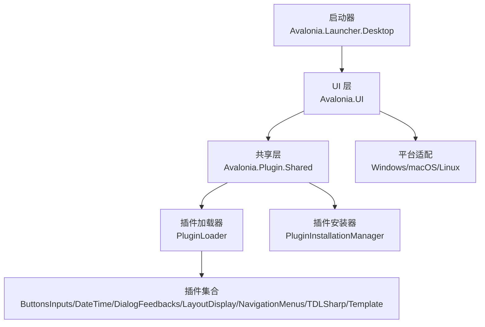
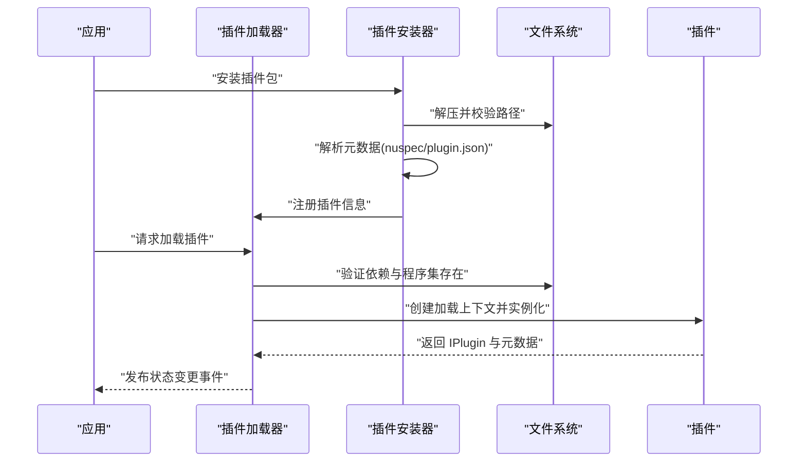
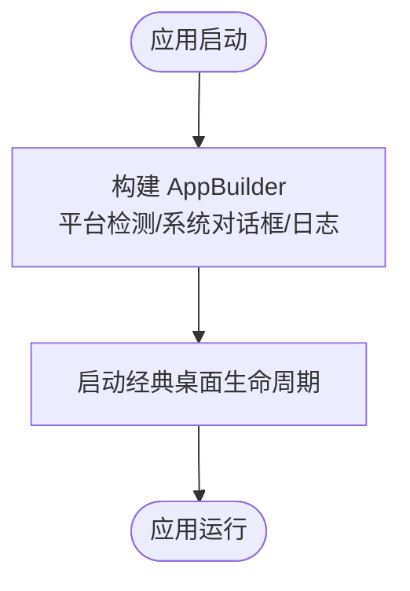
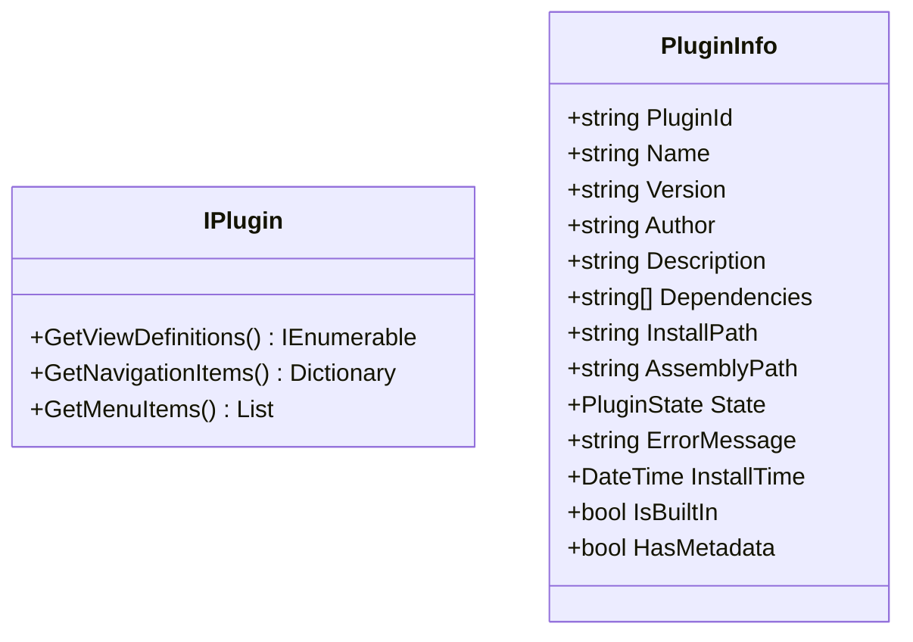
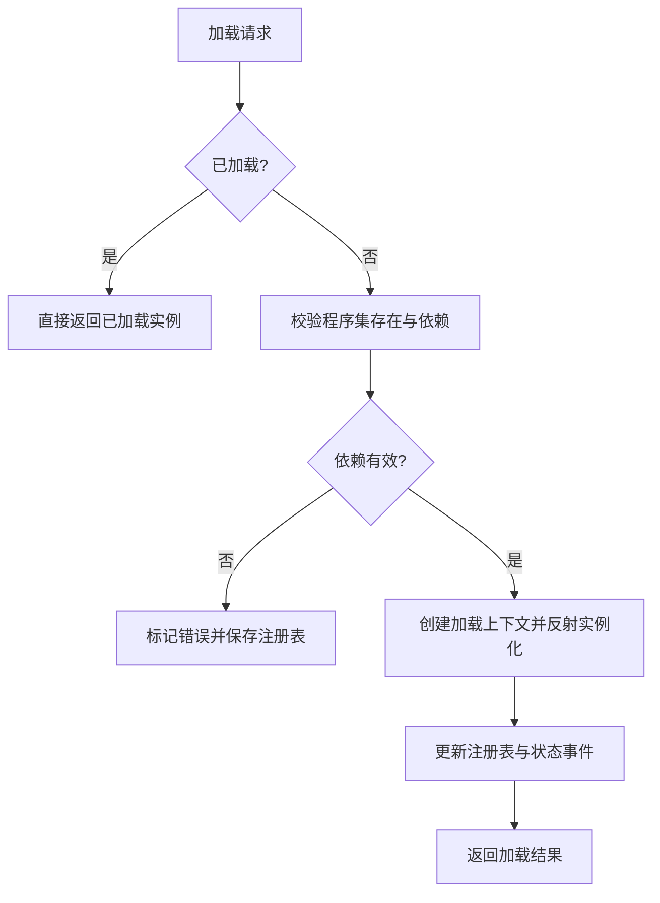
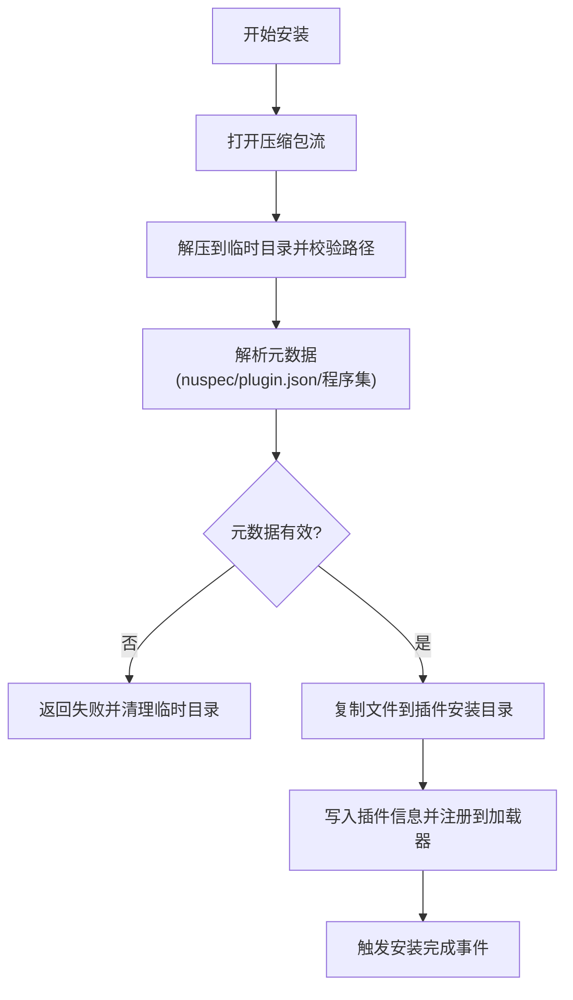
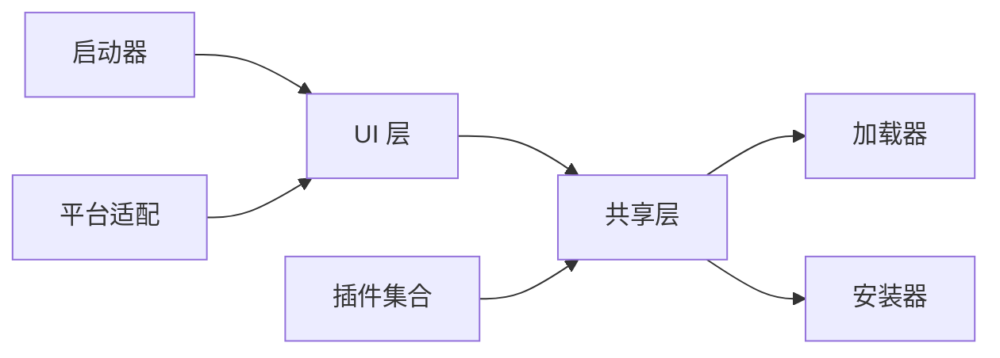

# 项目概述

<cite>
**本文档引用的文件**
- [Program.cs](file://src/launcher/Avalonia.Launcher.Desktop/Program.cs)
- [App.axaml](file://src/launcher/Avalonia.Launcher.Desktop/App.axaml)
- [IPlugin.cs](file://src/Avalonia.Plugin.Shared/IPlugin.cs)
- [PluginInfo.cs](file://src/Avalonia.Plugin.Shared/Models/PluginInfo.cs)
- [PluginLoader.cs](file://src/Avalonia.UI/Services/PluginLoader.cs)
- [PluginInstallationManager.cs](file://src/Avalonia.UI/Services/PluginInstallationManager.cs)
- [Avalonia.Plugin.Shared.csproj](file://src/Avalonia.Plugin.Shared/Avalonia.Plugin.Shared.csproj)
- [ButtonsInputsPlugin.cs](file://plugins/Avalonia.Plugin.ButtonsInputs/ButtonsInputsPlugin.cs)
- [MainWindow.axaml](file://src/Avalonia.UI/Views/MainWindow.axaml)
- [ApplicationViewModel.cs](file://src/Avalonia.UI/ViewModels/ApplicationViewModel.cs)
- [Avalonia.Platforms.Windows.csproj](file://src/platforms/Avalonia.Platforms.Windows/Avalonia.Platforms.Windows.csproj)
- [README.md](file://src/Avalonia.Platforms.Abstractions/README.md)
</cite>

## 目录
1. [引言](#引言)
2. [项目结构](#项目结构)
3. [核心组件](#核心组件)
4. [架构总览](#架构总览)
5. [详细组件分析](#详细组件分析)
6. [依赖分析](#依赖分析)
7. [性能考虑](#性能考虑)
8. [故障排除指南](#故障排除指南)
9. [结论](#结论)
10. [附录](#附录)

## 引言
AvaloniaTemplate 是一个面向桌面应用的插件化模板项目，旨在为开发者提供一个跨平台、可扩展且现代化的 Avalonia UI 应用基础架构。项目通过模块化的插件系统，实现了功能的动态加载与卸载，支持 Windows、macOS 和 Linux 平台，并内置了丰富的 UI 控件库与主题体系，便于快速构建企业级桌面应用。

本项目的核心价值在于：
- 跨平台支持：统一的 Avalonia UI 技术栈在三大主流桌面平台运行一致体验
- 动态插件系统：基于独立加载上下文的插件发现、加载、卸载与状态管理
- 现代化 UI 设计：基于 Irihi.Ursa 控件库与多套主题资源，提供丰富的交互控件
- 可扩展架构：通过共享接口与元数据机制，降低耦合度，提升可维护性

## 项目结构
项目采用“启动器 + 核心框架 + 插件集合 + 平台适配”的分层组织方式：
- 启动器层：负责应用入口、平台检测与生命周期管理
- 核心框架层：定义插件接口、元数据模型、插件加载与安装管理服务
- 插件层：按功能域拆分的多个插件，每个插件提供一组 UI 控件与演示页面
- 平台适配层：针对 Windows、macOS、Linux 的系统服务与原生能力封装

图表来源
- [Program.cs:11-23](file://src/launcher/Avalonia.Launcher.Desktop/Program.cs#L11-L23)
- [PluginLoader.cs:10-35](file://src/Avalonia.UI/Services/PluginLoader.cs#L10-L35)
- [PluginInstallationManager.cs:10-23](file://src/Avalonia.UI/Services/PluginInstallationManager.cs#L10-L23)

章节来源
- [Program.cs:11-23](file://src/launcher/Avalonia.Launcher.Desktop/Program.cs#L11-L23)
- [Avalonia.Plugin.Shared.csproj:1-30](file://src/Avalonia.Plugin.Shared/Avalonia.Plugin.Shared.csproj#L1-L30)

## 核心组件
- 启动器与应用构建
  - 启动器使用经典桌面生命周期，结合平台检测与系统对话框集成，确保在不同平台上获得一致的用户体验
  - 应用构建器配置日志输出与平台选项，便于调试与部署
- 插件接口与元数据
  - IPlugin 定义了插件的三大能力：视图定义映射、导航项与菜单项提供
  - PluginInfo 描述插件标识、版本、依赖、安装路径与状态等信息
- 插件加载与安装管理
  - PluginLoader 基于独立的 AssemblyLoadContext 实现插件隔离加载，支持注册表持久化、依赖校验与状态变更事件
  - PluginInstallationManager 支持从压缩包安装/卸载插件，解析 nuspec 或 plugin.json 元数据，保障安全性与可移植性
- UI 与视图模型
  - 主窗口采用 UrsaWindow 作为容器，内部嵌入主视图，提供统一的标题栏与图标
  - ApplicationViewModel 提供消息传递命令，用于跨视图导航跳转

章节来源
- [IPlugin.cs:9-26](file://src/Avalonia.Plugin.Shared/IPlugin.cs#L9-L26)
- [PluginInfo.cs:3-18](file://src/Avalonia.Plugin.Shared/Models/PluginInfo.cs#L3-L18)
- [PluginLoader.cs:10-35](file://src/Avalonia.UI/Services/PluginLoader.cs#L10-L35)
- [PluginInstallationManager.cs:10-23](file://src/Avalonia.UI/Services/PluginInstallationManager.cs#L10-L23)
- [MainWindow.axaml:1-23](file://src/Avalonia.UI/Views/MainWindow.axaml#L1-L23)
- [ApplicationViewModel.cs:7-14](file://src/Avalonia.UI/ViewModels/ApplicationViewModel.cs#L7-L14)

## 架构总览
AvaloniaTemplate 的整体架构围绕“插件即功能模块”的理念展开，核心流程如下：
- 应用启动后，加载器扫描插件目录与额外路径，解析插件元数据并建立加载上下文
- 安装器负责插件包的解压、元数据提取与安全校验，随后注册到加载器并触发加载
- 插件通过 IPlugin 接口暴露导航项、菜单项与视图映射，UI 层根据这些信息动态构建界面
- 平台适配层为各平台提供系统服务（如通知、位置、窗口管理），保证跨平台一致性

图表来源
- [PluginInstallationManager.cs:29-151](file://src/Avalonia.UI/Services/PluginInstallationManager.cs#L29-L151)
- [PluginLoader.cs:53-156](file://src/Avalonia.UI/Services/PluginLoader.cs#L53-L156)

## 详细组件分析

### 启动器与应用构建
- 入口函数通过构建器配置平台检测、系统对话框与日志输出，确保在 Windows 上启用 Win32 平台选项
- 经典桌面生命周期保证应用在不同平台上的窗口管理与退出行为一致

图表来源
- [Program.cs:11-23](file://src/launcher/Avalonia.Launcher.Desktop/Program.cs#L11-L23)

章节来源
- [Program.cs:11-23](file://src/launcher/Avalonia.Launcher.Desktop/Program.cs#L11-L23)

### 插件接口与元数据模型
- IPlugin 接口定义了插件向宿主暴露的能力边界：视图定义映射、导航项与菜单项
- PluginInfo 模型承载插件的标识、版本、作者、描述、依赖、安装路径、状态与错误信息等

图表来源
- [IPlugin.cs:9-26](file://src/Avalonia.Plugin.Shared/IPlugin.cs#L9-L26)
- [PluginInfo.cs:3-18](file://src/Avalonia.Plugin.Shared/Models/PluginInfo.cs#L3-L18)

章节来源
- [IPlugin.cs:9-26](file://src/Avalonia.Plugin.Shared/IPlugin.cs#L9-L26)
- [PluginInfo.cs:3-18](file://src/Avalonia.Plugin.Shared/Models/PluginInfo.cs#L3-L18)

### 插件加载器（PluginLoader）
- 独立加载上下文：为每个插件创建隔离的 AssemblyLoadContext，避免程序集冲突
- 注册表持久化：以 JSON 文件记录已安装插件及其状态，支持重启后恢复
- 依赖校验：在加载前检查依赖是否已加载，确保插件链路完整性
- 状态管理：提供加载、卸载、禁用、启用与卸载标记等状态转换事件

图表来源
- [PluginLoader.cs:53-156](file://src/Avalonia.UI/Services/PluginLoader.cs#L53-L156)

章节来源
- [PluginLoader.cs:10-35](file://src/Avalonia.UI/Services/PluginLoader.cs#L10-L35)
- [PluginLoader.cs:53-156](file://src/Avalonia.UI/Services/PluginLoader.cs#L53-L156)

### 插件安装器（PluginInstallationManager）
- 安全安装：校验压缩包路径遍历风险，逐条解压并复制到目标目录
- 元数据解析：优先解析 nuspec，其次尝试 plugin.json，最后回退到程序集元数据
- 生命周期管理：支持启用/禁用/卸载插件，卸载时标记待删除并在合适时机清理

图表来源
- [PluginInstallationManager.cs:29-151](file://src/Avalonia.UI/Services/PluginInstallationManager.cs#L29-L151)

章节来源
- [PluginInstallationManager.cs:10-23](file://src/Avalonia.UI/Services/PluginInstallationManager.cs#L10-L23)
- [PluginInstallationManager.cs:29-151](file://src/Avalonia.UI/Services/PluginInstallationManager.cs#L29-L151)

### 示例插件（ButtonsInputsPlugin）
- 使用元数据生成特性标注插件基本信息，声明插件标识与依赖
- 通过部分类实现 IPluginMetadata 接口，为后续生成工具链提供元数据支持

章节来源
- [ButtonsInputsPlugin.cs:6-24](file://plugins/Avalonia.Plugin.ButtonsInputs/ButtonsInputsPlugin.cs#L6-L24)

### UI 与视图模型
- 主窗口采用 UrsaWindow 作为根容器，内嵌主视图，设置最小尺寸与图标
- ApplicationViewModel 提供跨视图导航命令，通过弱引用消息总线进行通信

章节来源
- [MainWindow.axaml:1-23](file://src/Avalonia.UI/Views/MainWindow.axaml#L1-L23)
- [ApplicationViewModel.cs:7-14](file://src/Avalonia.UI/ViewModels/ApplicationViewModel.cs#L7-L14)

### 平台适配层
- Windows 平台项目引用抽象层与 Avalonia 核心，集成系统通知、系统事件与原生 API 工具
- 平台抽象层 README 简要说明了跨平台抽象的设计意图

章节来源
- [Avalonia.Platforms.Windows.csproj:1-26](file://src/platforms/Avalonia.Platforms.Windows/Avalonia.Platforms.Windows.csproj#L1-L26)
- [README.md:1-3](file://src/Avalonia.Platforms.Abstractions/README.md#L1-L3)

## 依赖分析
- 技术栈概览
  - UI 框架：Avalonia + Irihi.Ursa 控件库
  - MVVM：CommunityToolkit.Mvvm
  - 依赖注入：Microsoft.Extensions.DependencyInjection
  - 数据访问：Microsoft.EntityFrameworkCore.Sqlite
  - 响应式编程：System.Reactive
  - 平台集成：Windows/macOS/Linux 平台项目引用抽象层与系统服务
- 组件耦合
  - 启动器仅依赖 UI 层；UI 层依赖共享层；共享层定义插件接口与模型，被加载器与安装器共同使用
  - 插件层通过接口与元数据与宿主解耦，实现高内聚低耦合

图表来源
- [Avalonia.Plugin.Shared.csproj:10-17](file://src/Avalonia.Plugin.Shared/Avalonia.Plugin.Shared.csproj#L10-L17)
- [PluginLoader.cs:10-21](file://src/Avalonia.UI/Services/PluginLoader.cs#L10-L21)
- [PluginInstallationManager.cs:12-21](file://src/Avalonia.UI/Services/PluginInstallationManager.cs#L12-L21)

章节来源
- [Avalonia.Plugin.Shared.csproj:10-17](file://src/Avalonia.Plugin.Shared/Avalonia.Plugin.Shared.csproj#L10-L17)

## 性能考虑
- 插件隔离加载：通过独立的 AssemblyLoadContext 避免全局程序集污染，减少内存碎片与冲突
- 注册表持久化：减少重复扫描与解析成本，提高启动速度
- 依赖预校验：在加载前完成依赖检查，避免运行时异常导致的性能损耗
- 资源与主题：Irihi.Ursa 提供轻量级主题与动画，建议按需加载与懒加载策略进一步优化首屏渲染

## 故障排除指南
- 插件未加载
  - 检查插件程序集是否存在与可访问
  - 查看注册表中插件状态与错误信息
  - 确认依赖插件均已加载成功
- 安装失败
  - 确认压缩包未被篡改，避免路径遍历风险
  - 检查 nuspec 或 plugin.json 是否符合规范
- 卸载后残留
  - 等待待卸载队列处理或手动清理插件目录
- 平台相关问题
  - Windows 平台请确认 Win32 选项与系统权限
  - macOS/Linux 平台请检查平台服务可用性与权限

章节来源
- [PluginLoader.cs:76-92](file://src/Avalonia.UI/Services/PluginLoader.cs#L76-L92)
- [PluginInstallationManager.cs:62-78](file://src/Avalonia.UI/Services/PluginInstallationManager.cs#L62-L78)
- [PluginInstallationManager.cs:374-404](file://src/Avalonia.UI/Services/PluginInstallationManager.cs#L374-L404)

## 结论
AvaloniaTemplate 以插件化为核心，结合跨平台 UI 框架与模块化设计，为桌面应用开发提供了高扩展性与可维护性的基础架构。通过清晰的接口定义、完善的加载与安装机制以及平台适配层，项目既适合初学者快速上手，也为有经验的开发者提供了深入定制的空间。建议在实际项目中遵循插件元数据规范与依赖管理策略，持续演进 UI 与业务能力。

## 附录
- 应用场景
  - 企业级桌面工具：通过插件扩展功能模块，满足不同部门需求
  - 原型与演示：利用丰富的控件与主题快速搭建交互原型
  - 跨平台迁移：统一技术栈降低多平台维护成本
- 最佳实践
  - 明确插件职责边界，避免过度耦合
  - 使用元数据驱动的导航与菜单生成，保持 UI 一致性
  - 在安装器中加入更细粒度的进度反馈与错误提示
  - 对大型插件采用延迟加载与懒初始化策略